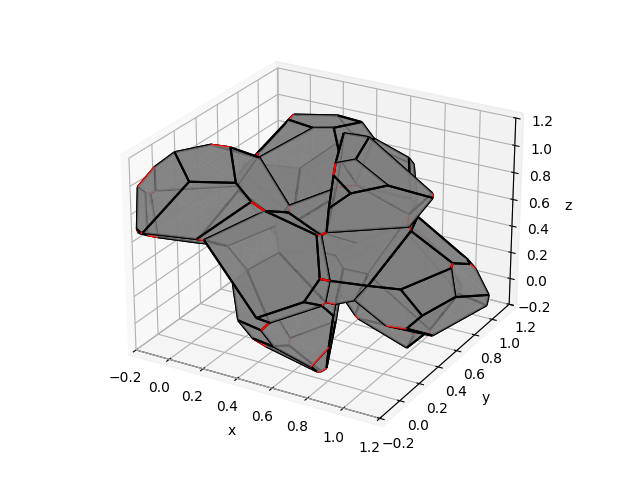
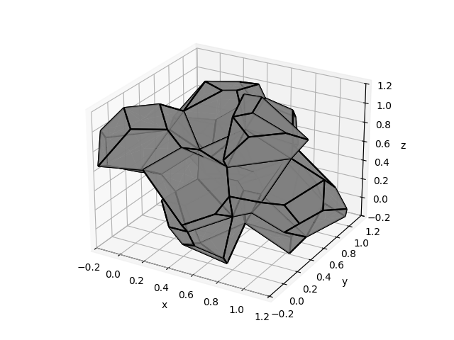

# tessToPy
tessToPy is a python package for representing a tessellated structure generated by Neper (https://neper.info/). This tessellation representation can be combined with a python representation of the discretized structure and used to write input files for finite element analysis (FEA). The primary function of the code is to regularize a periodic tessellation. The regularization tries to remove short edges from the structure, as short edges could be detremental to the overall quality of a FEA mesh. 

A unregularized and regularized tessellation is shown below:

:-------------------------:|:-------------------------:
|
Unregularized structure with edges to be deleted | Regularized structure with edges deleted